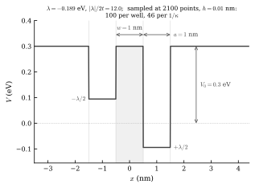
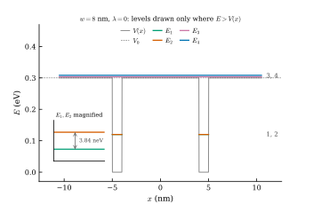
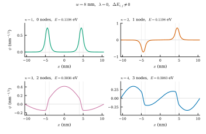
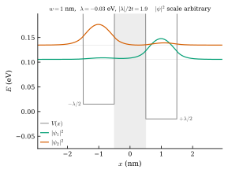
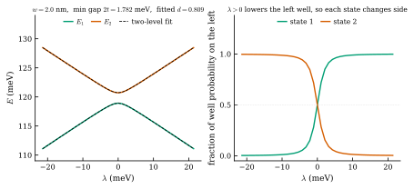
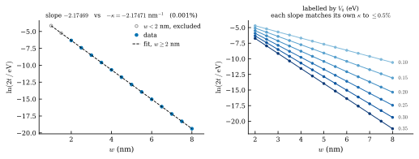

# Simulating energy levels in a changing quantum system

A 1D finite-difference solver for the time-independent Schrödinger equation, applied to a
tilted double well, used to measure the exponential decay of tunnel splitting with barrier
width. Symbols and their values in [symbols.txt](symbols.txt).

## The problem

An electron confined by a potential has a discrete set of allowed energies, fixed by the shape
that confines it. For two identical wells side by side, symmetry suggests the lowest energy
should appear twice over. Driving the two levels together instead closes them to within one
part in thirty million of the level energy and stops, because neither state belongs to one
well: a wavefunction does not stop at a wall it cannot cross, it leaks through, and that
forbids two states of equal energy.

This project follows both levels through the deformation and recovers the decay rate inside the
barrier from how the energy gap collapses with width.

## The system

<p align="center">

</p>

Two wells of width $a$ (1 nm) and depth $V_0$ (0.30 eV) are separated by a barrier of width
$w \in \{1, 1.5, 2, \ldots, 8\}$ nm, held at the same potential as the region outside them. $a$
and $V_0$ are chosen such that one well holds exactly one bound state, so the double well holds
two and nothing else. The tilt displaces the left floor by $-\lambda/2$ and the right by
$+\lambda/2$, so a sweep starts at negative $\lambda$ with the left well raised, as shown, and
runs up through zero to positive $\lambda$ where the system is mirrored.

## Method

Finite differences is chosen rather than a shooting method or a basis expansion because the
discretised operator is sparse and symmetric, one diagonalisation returns every state at once,
and no basis has to be chosen in advance. The cost is second-order accuracy, which the box
check measures rather than assumes.

### `hamiltonian`: discretising the TISE

Start from the time-independent Schrödinger equation,

```math
-\frac{\hbar^2}{2m}\psi'' + V(x)\,\psi = E\psi
```

Replace continuous $x$ by a grid of $M$ (2100) points of spacing $h$ (0.01 nm), then substitute
the central-difference second derivative. This gives one equation per grid point,

```math
-k\psi_{i-1} + (2k+V_i)\,\psi_i - k\psi_{i+1} = E\psi_i,
\qquad k = \frac{\hbar^2}{2m_eh^2}
```

which is the matrix equation $H\psi = E\psi$ with $H$ tridiagonal:

```math
H=\begin{pmatrix}
2k{+}V_1 & -k & 0 & \cdots & 0 \\
-k & 2k{+}V_2 & -k & \cdots & 0 \\
0 & -k & 2k{+}V_3 & \ddots & \vdots \\
\vdots & & \ddots & \ddots & -k \\
0 & 0 & \cdots & -k & 2k{+}V_M
\end{pmatrix}
```

Truncating the grid imposes $\psi = 0$ at the walls, so the box has width $L = (M{+}1)h$ (21.01
nm) and the spectrum is discrete. Return $H$, and $V$ so the potential can be checked
independently.

### `track` and `sweep`: following each state, then each width

`track` diagonalises $H$ at each $\lambda$ and matches every new eigenvector to the previous
one by overlap, so a state that changes wells keeps its identity rather than its rank in
energy.

`sweep` rebuilds the $\lambda$ grid for each barrier width, scaled to that width's own gap and
always containing zero, because the crossing narrows exponentially with $w$ and one fixed grid
would step over it.

### `measure`: fitting

Project the double well onto its two localised states, formed from the solver's symmetric and
antisymmetric pair with $\psi_A$ taken positive in the left well,

```math
\phi_L = \tfrac{1}{\sqrt{2}}\left(\psi_S + \psi_A\right), \qquad
\phi_R = \tfrac{1}{\sqrt{2}}\left(\psi_S - \psi_A\right)
```

each holding over 99% of its probability in one well. In that basis the Hamiltonian becomes

```math
H_{\mathrm{eff}}=\begin{pmatrix}
-\varepsilon/2 & -t \\
-t & +\varepsilon/2
\end{pmatrix},
\qquad \varepsilon = d\lambda
```

where $t$ is the tunnelling energy,set by the wavefunction overlap, and $\varepsilon$ is the
energy difference the tilt opens between the two. Only the well interiors are tilted, so
$\varepsilon = d\lambda$ with $d$ the fraction of a localised state's $|\psi|^{2}$ lying inside
its own well. The two eigenvalues are separated by

```math
\Delta E(\lambda) = \sqrt{\varepsilon^{2}+4t^{2}}
                  = \sqrt{(d\lambda)^{2}+(2t)^{2}}
```

`measure` compares the form above to the computed gap at one $w$ to get $d$ and $2t$, then fits
the collapse across the sweep,

```math
\ln 2t = \mathrm{const} - \kappa w
```

where $\kappa$ is the rate at which $\psi$ decays inside the barrier, fixed by how far the
state energy $E$ lies below it,

```math
\kappa=\frac{\sqrt{2m(V_0-E)}}{\hbar}
```

Every one of the three is checked against an independent route: $2t$ against the gap read
directly at $\lambda = 0$, $d$ against that fraction read straight off a localised state, and
$\kappa$ against the expression above, which uses the potential alone and no gap at all.

## The bound states

<p align="center">


</p>

A symmetric double well produces these four lowest eigenvalues and eigenstates from
$H\psi = E\psi$. Each level is drawn only where $E > V(x)$: $E_1, E_2$ are bound inside the
wells, while $E_3, E_4$ clear $V_0$ and span the box. State $n$ carries $n-1$ nodes. The two
identical wells still do not give one energy twice over: the barrier is finite, so each tail
leaks into it and couples the wells, splitting $E_1, E_2$ apart. The inset magnifies that
split, 3.84 neV against energies of 0.12 eV.

## Tilting the wells

<p align="center">

</p>

Pushing the left floor to $-\lambda/2$ and the right to $+\lambda/2$ breaks that symmetry, so
$\psi_1, \psi_2$ need not split evenly. With $\lambda$ negative the right well sits lower, and
$\psi_1$ shifts weight into it, lowering $\int V|\psi|^{2}\,\mathrm{d}x$. That shift raises
$\tfrac{\hbar^{2}}{2m}\int|\psi'|^{2}\,\mathrm{d}x$, so the gain in potential energy is paid
for in kinetic energy and the localisation grows only gradually with $\lambda$. $\psi_2$,
orthogonal to $\psi_1$, is therefore dominated by the left well. At $|\lambda|/2t = 1.9$ rather
than the sweep's extreme of 12 above, the tilt dominates the coupling without completing
localisation, so each state keeps visible probability density on the disfavoured side.

## The avoided crossing

<p align="center">

</p>

Sweeping $\lambda$ through zero brings the two levels together and turns them away, with the
two-level fit lying on both curves. Equal eigenvalues of $H_{\mathrm{eff}}$ need
$\varepsilon = 0$ and $t = 0$ at once, and $\lambda$ is a single real parameter, moving the
well floors without ever touching the barrier that sets $t$. The levels therefore repel instead
of crossing, bottoming out at $2t = 1.782$ meV, and the degeneracy is reached only as
$w \to \infty$. That is the von Neumann and Wigner no-crossing rule: the tunnel coupling $t$ is
what stops the two levels becoming equal.

Non-degeneracy fixes the ordering of the energies, so the exchange is forced onto the states
instead. The right panel shows them trading places through $\lambda = 0$: forbidden to cross in
energy, the pair crosses in character. A slow sweep therefore carries the electron bodily from
one well to the other, through a barrier it could never climb. Had the levels been free to
cross, the electron would have stayed where it started.

## The collapse

<p align="center">

</p>

The left panel is the measurement. $\ln 2t$ against $w$ is a straight line, so $2t$, the gap at
$\lambda = 0$, falls exponentially with barrier width: the fit spans 13 in $\ln 2t$, a drop of
about half a million between $w = 2$ and $w = 8$ nm. Its slope is $-2.1747$ nm⁻¹, and $\kappa$
built from $V_0 - E$, which uses the potential and the state energy alone, is $2.1747$ nm⁻¹:
the same number by an independent route. The right panel repeats the fit at six well depths,
the numbers beside each line being $V_0$ in eV, and every slope follows its own $\kappa$ rather
than settling at one value. Points below $w = 2$ nm are drawn but excluded from the fit, where
the wells couple strongly enough that the local slope has not yet reached $-\kappa$.

The line is straight because of the form of $t$, the off-diagonal element of
$H_{\mathrm{eff}}$, defined by

```math
t = -\int \phi_L^{*}\,\hat{H}\,\phi_R\,\mathrm{d}x = -\langle \phi_L | \hat{H} | \phi_R \rangle
```

This is the matrix element that couples the two localised states, turning the pair into one
system rather than two independent wells. Substituting the definitions of $\phi_L$ and $\phi_R$
gives
$\langle \phi_L | \hat{H} | \phi_R \rangle = \phi_L^{T} H \phi_R = \tfrac{1}{2}(E_S - E_A)$, so
$2t = E_A - E_S$. Inside the barrier the two states decay from opposite sides,

```math
\phi_L \sim e^{-\kappa(x + w/2)}, \qquad \phi_R \sim e^{-\kappa(w/2 - x)}
```

and their product is $e^{-\kappa w}$, the $x$-dependence cancelling exactly, so $w$ enters $t$
through that exponential alone.

So $\kappa = 2.17$ nm⁻¹: inside the wall the amplitude falls by a factor $e$ every
$1/\kappa = 0.46$ nm, and the probability sits on average $1/2\kappa = 0.23$ nm in. Every
further 0.46 nm of barrier then divides $2t$ by $e$ and multiplies the crossing time by the
same, taking an electron placed in one well from 0.13 ps at $w = 1$ nm to 0.54 μs at $w = 8$
nm.

That minimum gap is what limits how fast a system can be deformed without leaving its ground
state, so an exponentially small gap makes any such process exponentially slow: the obstacle in
adiabatic quantum computing and the quantity in the Landau-Zener problem. The same
$e^{-\kappa w}$ is why transfer integrals in a solid fall off with distance at all.

## Results

| | measured | independent | agreement |
|---|---|---|---|
| $-\kappa$ (nm⁻¹) | −2.17469 | −2.17471 from $V_0-E$ | **0.001 %** |
| $2t$ (eV) | 1.7815e-03 | 1.7813e-03 at $\lambda=0$ | 0.01 % |
| $d$ | 0.8087 | 0.8088 from the wavefunction | 0.01 % |
| $-\kappa$ at six depths | six slopes | six values from $V_0-E$ | worst 0.47 % |
| $\kappa$ stability, three grids (nm⁻¹) | range 3.4e-05 | $h/3$ and a wider box | 0.002 % of $\kappa$ |
| box energies, $n=1\ldots6$ | worst 6.7e-06 | $E_n = n^2\pi^2\hbar^2/2mL^2$ | $\leq$ 7e-06 |
| $O(h^2)$ truncation | error ratio 4.0031 on halving $h$ | 4 for a three-point stencil | 0.08 % |
| nodes of the lowest 8 states | 0,1,2,3,4,5,6,7 | node theorem gives $n-1$ for state $n$ | exact |
| smallest gap swept | 3.84e-09 eV | float64 floor 3.4e-13 eV | 11000x above the floor |

## Run

```
git clone https://github.com/kv2304/simulating-energy-levels-in-a-changing-quantum-system.git
cd simulating-energy-levels-in-a-changing-quantum-system
pip install -r requirements.txt
python levels.py     # ~3s, redraws figures/
```
